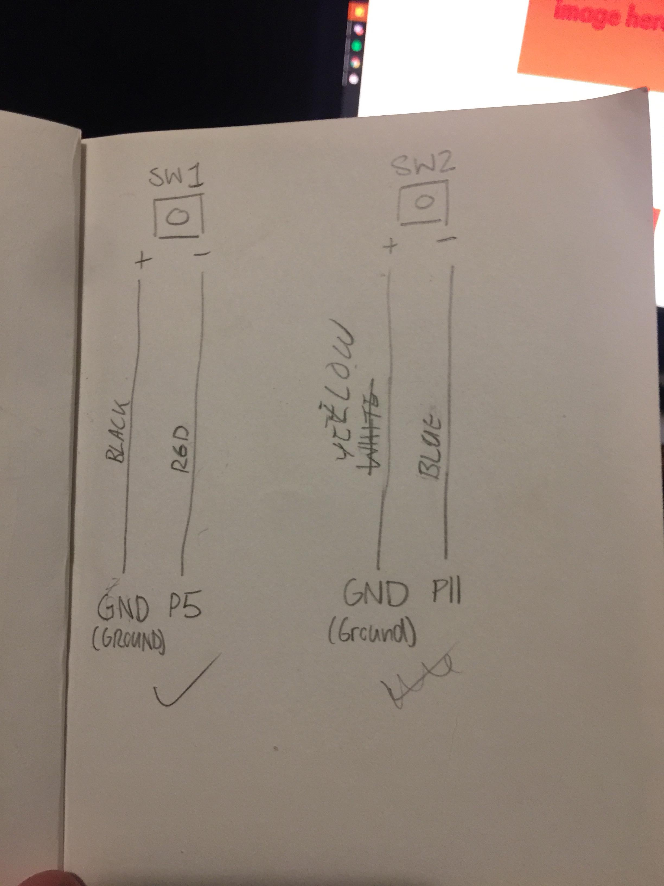

# Assessment 1: Replication project

*Fill out the following workbook with information relevant to your project.*

*Markdown reference:* [https://guides.github.com/features/mastering-markdown/](http://guides.github.com/features/mastering-markdown/)

## Train Timing Gates ##

## Related projects ##
*Find about 6 related projects to the project you choose. A project might be related through  function, technology, materials, fabrication, concept, or code. Don't forget to place an image of the related project in the* `replicationproject` *folder and insert the filename in the appropriate places below. Copy the markdown block of code below for each project you are showing, updating the number* `1` *in the subtitle for each.*

### ELECTRIC WORKING MODEL RAILWAY ###
https://www.youtube.com/watch?v=bc6jyj93Ee4

This Project related to my project as it is very close as to what i am trying to achieve with an automatic boom gate opening when the train touches a switch that is further down the track then comes back down when the train has touched another switch on the other side.

### Project 2 ###
https://www.youtube.com/watch?v=FDw9CLabdQk

This will be used in my project to signal when the cars need to stop for the train and when the gates come down for the train to pass.

### Project 3 ###
https://www.youtube.com/watch?v=6yCbtgr7rSI

This just shows timing of traffic lights and keeping a flow… I thought it was cool. It might help with the timing of the train boom gate going up and down to let traffic thru.

### Project 4 ###
https://www.youtube.com/watch?v=piyym_ux1EM
https://www.youtube.com/watch?v=N4bWQcu6yWs
https://www.youtube.com/watch?v=zi_-NAmdDpY
https://www.youtube.com/watch?v=M3DIUvDPlIA

The original project that I am replicating. 

### Project 5 ###
https://www.youtube.com/watch?v=okxooamdAP4

How to use a servo motor if I can get one and use it… I might use something else to make the boom gate.


## Reading reflections ##
*Reflective reading is an important part of actually making your reading worthwhile. Don't just read the words to understand what they say: read to see how the ideas in the text fit with and potentially change your existing knowledge and maybe even conceptual frameworks. We assume you can basically figure out what the readings mean, but the more important process is to understand how that changes what you think, particularly in the context of your project.*

*For each of the assigned readings, answer the questions below.*

### Reading: Don Norman, The Design of Everyday Things, Chapter 1 (The Psychopathology of Everyday Things) ###

*What I thought before: Describe something that you thought or believed before you read the source that was challenged by the reading.*

- Making something easy to understand for the user creates a more pleasant experience. An example of a challenging thing to understand is putting together IKEA Furniture… especially back in the day of the print not being too great. The imagery for some of the parts was not accurate to what was actually supposed to be where, this caused people to get frustrated building the furniture and sometimes even over-threading screws and things they needed for that particular project.
- Feedback is very important…. Most people/products ignore it.


*What I learned: Describe what you now know or believe as a result of the reading. Don't just describe the reading: write about what changed in YOUR knowledge.*

- “Affordances” gives clues to the operator about what to do with that object (balls are for throwing or bouncing, knobs are for turning, etc.)
- Affordances are relationships… NOT PROPERTIES!
- An icon for where a person could be directed to tap on something such as a button on the screen can be referred to as a “Signifier”. (eg. the touch screen is the affordance and the icons are the signifier of where you need to touch for the action to happen)
-There are intentional and unintentional signifiers
- External signifiers= bad design\
- Mapping- The relationship between the elements of two things.
- Feedback- communicating the results of an action.
- If the delay of feedback is too long people will often give up or go to do something else.
- Auditory feedback can sometimes be confusing
- Too much feedback can be annoying more than too little.
- A conceptual model is an explanation of how something works in the most simplified way possible. 

*What I would like to know more about: Describe or write a question about something that you would be interested in knowing more about.*

- What can determine a good design and a bad design?
- What's good feedback and what's bad feedback?
- How to make my feedback for a product meaningful but not annoying?

*How this relates to the project I am working on: Describe the connection between the ideas in the reading and one of your current projects or how ideas in the reading could be used to improve your project.*

- This reading can help me with my project with making sure the signifiers for the project are clear.
- How to create clear feedback as to when the gates are down.
- What the affordances and the signifiers are of the project.

### Reading: Chapter 1 of Dan Saffer, Microinteractions: Designing with Details, Chapter 1 ###

*What I thought before: Describe something that you thought or believed before you read the source that was challenged by the reading.*

I don't know

*What I learned: Describe what you now know or believe as a result of the reading. Don't just describe the reading: write about what changed in YOUR knowledge.*

- A microinteraction is a tiny piece of functionality (eg. an app or device or something inside a larger product).
- Microinteractions are the glue of the product, it ties different features of a product all together.
- Larry Tesler invented “copy” and “paste”
- Dramatically reduced the time and complexity of what seems to be a simple function.
- We use a lot of physical terms to describe digital interactions (eg. putting a file into a folder).

*What I would like to know more about: Describe or write a question about something that you would be interested in knowing more about.*

- How to create microinteractions that flow nicely with each other?

*How this relates to the project I am working on: Describe the connection between the ideas in the reading and one of your current projects or how ideas in the reading could be used to improve your project.*

I don't know how I can incorporate this into my project.

### Reading: Scott Sullivan, Prototyping Interactive Objects ###

*What I thought before: Describe something that you thought or believed before you read the source that was challenged by the reading.*

I don't know...

*What I learned: Describe what you now know or believe as a result of the reading. Don't just describe the reading: write about what changed in YOUR knowledge.*

- Anyone can code (and will get overly excited with little output).
- You may find big flaws after the deployment, requiring a new approach to the situation. Even if that means starting from scratch :).

*What I would like to know more about: Describe or write a question about something that you would be interested in knowing more about.*

- Why did it take you so long? 

*How this relates to the project I am working on: Describe the connection between the ideas in the reading and one of your current projects or how ideas in the reading could be used to improve your project.*

I don't know how I can incorporate this into my project.

## Interaction flowchart ##


## Process documentation

*In this section, include text and images that represent the development of your project including sources you've found (URLs and written references), choices you've made, sketches you've done, iterations completed, materials you've investigated, and code samples. Use the markdown reference for help in formatting the material.*

*This should have quite a lot of information!*

*There will likely by a dozen or so images of the project under construction. The images should help explain why you've made the choices you've made as well as what you have done. Use the code below to include images, and copy it for each image, updating the information for each*

*Include screenshots of the code you have used.*

Before I started the project, I looked through the choices provided to find out what stands out the most to me. I seen the timing gates project and it peeked my interest. I had a look through what the project was and started brainstorming ways I could replicate and add to it.

My dad helped with the decision and trains came to mind. So I begin to put together a small train platform. I am lucky my dad also had model train sets, that came with decorative pieces I could use for the aesthetics.


I took the timing gates into mind and decided to make use of it for traffic lights. Microbit's project 11 was perfect for this. It provided exactly what I needed, with its' pedestrian example. It used 3 LED lights for the traffic light, 2 LED lights for the pedestrian lights and a buzzer to add to the auditory aesthetic of a traffic light.


I put this into play with the train idea and turned it into a stop and go light for the train (pedestrian light) and traffic lights for cars to cross the track safely. I had assistance from my dad to cut and sand the wood used for the platform, to make a cutout section for the crossing.


I needed a way for the train to trigger the lights to switch over, so I used a switch. This way, when a train comes into contact with it, the Microbit will be triggered and will toggle the lights and allow for the train to pass. 

Once the basic setup for the project was done (Track and platform), I started working with the microbit. I started very basic, using the simple two switch circuit in the book provided with the microbit. Proceeding onto the traffic light circuit, which happened to fit perfectly with the switch setup, with no comflicts in wiring (even though the button circuit only used 4 pins).



With some assistance from my partner, I was able to piece together the code to make it work together, based on switch inputs and only changing back when the opposite switch is pressed. Each interaction is split into its own function, which is a block of code that can be called from anywhere. These also make sure the process cannot be restarted. Eg. If the lights are already toggled, pressing switch 1 will not try to toggle it back from the beginning. As well as using input while it is switching, it will not start the process if it is already in the course of toggling. 

The inputs are as simple as:

```javascript

	input.onButtonPressed(Button.A, function () {

		toggleOn()
	})

	input.onButtonPressed(Button.B, function () {

		toggleOff()
	})
	
```

Both of these functions are in charge of toggling the LED lights at the respective light post, as well as making sure the process cannot be started again or done whilst in the means of doing so.

As user based feedback, the microbit will show a symbol on its LED matrix to show whether or not the cars are allowed through or not, this helped majorly when debugging certain aspects and allowed me to know what was happening.

The code is as follows:

```javascript

	basic.forever(function () {

		// Happy face - toggled off
		// STOP! - toggled on

		// Go
		if (toggled == false) {

			basic.showLeds(`
			. # . # .
			. # . # .
			. . . . .
			# . . . #
			. # # # .
			`)
		}
		else {

			// Play buzzer
			music.playTone(buzzNote, music.beat(BeatFraction.Whole))

			basic.showLeds(`
			. # # # .
			# . . . #
			# . . . #
			# . . . #
			. # # # .
			`)
			basic.pause(buzzWaitTime)
		}
	})

```

Surprisingly the code was not a big part of the process of making the project, more time went into the aesthetic and its functionality. Once the code was uploaded and it was set into place with the platform it looked a little something like this.


You can see the environment being made up and the switch being used to toggle the lights, also seen in the image above. Some extra electronic parts were used, that did not come stock with the microbit kit, as some of the components that were supplied, would not have done the job needed. I was able to get a good use of the components provided in the kit, as I was able to use all the wires, most if not all of the LEDs and some resistors.

At last, with almost a week straight of solid work designing, building and coding, I was able to get something made that actually works as it was intended.


## Project outcome ##

### Train Timing Gates ###

### Project description ###

This project is based off the timing gates project (11). It uses gate switches to toggle the lights for the train and start the traffic lights, so that a boom gate is triggered to stop traffic. I would say a project like this, is for people who like and are interested in model trains, and their track development. It allows for more automation through their track and more realism when it comes to road and rail networks.

### Showcase image ###


### Additional view ###


### Reflection ###

*Describe the parts of your project you felt were most successful and the parts that could have done with improvement, whether in terms of outcome, process, or understanding.*

Improvement wise, the switches that toggled the lights etc. did not always toggle and would also derail the train at times. As seen in the video, the train was also pushed along instead of using its controller because it was a bit fragile. The switches were a bit difficult to push down, maybe a form of weight within the train could have helped or finding an alternative to the switch.

Everything else worked according to plan, minus the last second boom gate. All the lights toggled when they needed to and there was no issues with it toggling more than once (Which was an issue during the development of the microbit code).

The photos don't really do it justice, it did look and feel a lot better when everything was seen in the light and the buildings cased the exposed wiring along the platform area.

*What techniques, approaches, skills, or information did you find useful from other sources (such as the related projects you identified earlier)?*

In the way of circuitry, all that was needed was a simple 2 button circuit added onto the traffic light circuit in project 11. All that was needed were very slight modifications to get it working all together. This only included splitting the traffic code into two sections and using inputs for the on and off state, rather than a completely timed system.

*What ideas have you read, heard, or seen that informed your thinking on this project? (Provide references.)*

While researching the timing gates, a lot of train system videos came up as well as my dad mentioning a train track with the lights. So it seemed like a good idea to go ahead on that idea, especially when most of the parts required for that project were already available to me. 

Link provided above, under "ELECTRIC WORKING MODEL RAILWAY" for a strong influence on the project.

*What might be an interesting extension of this project? In what other contexts might this project be used?*

An nice extension I believe, would be a network of tracks that followed the light system. Having multiple trains run at once, maybe with some cars making use of the traffic lights. It would be nice to see a bunch of trains going at once, all together in an expanded version.

Instead of just a fully built up train network, just one system could be built into a small town or city project, as it would make use of the traffic light section of the build.
